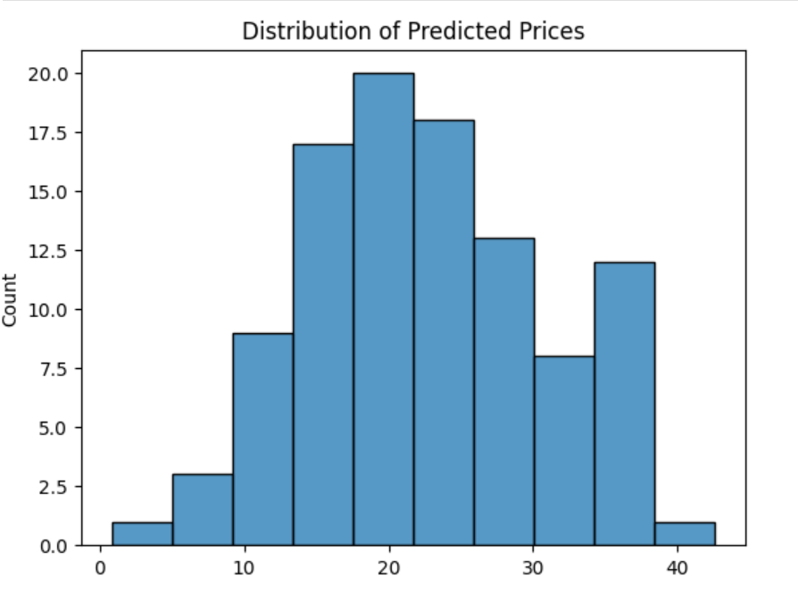

# house-price-prediction
Machine Learning project to predict house prices using regression and data analysis techniques.
# House Price Prediction

## 📊 Overview
This project predicts house prices using machine learning techniques. It analyzes housing data and builds a regression model to estimate property values.

## 🛠 Tools & Technologies
- Python
- Pandas
- NumPy
- Scikit-learn
- Matplotlib / Seaborn

## 📈 Process
- Data loading and preprocessing
- Exploratory Data Analysis (EDA)
- Feature selection
- Model training using Linear Regression
- Model evaluation using Mean Squared Error

## 🔍 Results
- The model is able to predict house prices with reasonable accuracy
- Visualization shows a relationship between actual and predicted prices
- Some prediction errors exist due to simplicity of the model

## 📁 Files
- Housing.ipynb → main notebook
- house.csv → dataset

## 🚀 Future Improvements
- Use advanced models (Random Forest, XGBoost)
- Improve feature engineering
- Tune model for better accuracy

